# Esquema Relacional de Base de Datos

Documentación del modelo de datos PostgreSQL de Rebel Crown Legacy (RCL), sincronizado entre `packages/database/src/schema.ts` y el esquema inicial único `0000_initial_schema.sql`, que incluye la autenticación Discord.

Para el contexto de diseño, operaciones y mapeo de partidas:
- [**Modelo y Decisiones Arquitectónicas**](database.md): Decisiones de diseño, desempate y garantías relacionales.
- [**Operaciones, Concurrencia y Comandos**](database-operations.md): Bloqueos consultivos (`pg_advisory_lock`, `pg_advisory_xact_lock`), configuración del pool y comandos CLI.
- [**Mapeo de Estadísticas ROFL**](rofl-mapping.md): Correspondencia detallada de métricas JSON de repeticiones hacia tablas relacionales.

---

## Diagrama Entidad-Relación (Mermaid ER)

El esquema se compone de 19 tablas: las 17 de competición, jugadores, auditoría y pronósticos del diagrama siguiente, más `auth_sessions` y `oauth_states`, descritas en [autenticación](../authentication.md). `auth_sessions.discord_user_id` referencia `discord_users.discord_id` con borrado en cascada; ambas tablas nuevas almacenan hashes de tokens y fechas de caducidad indexadas.

```mermaid
erDiagram
    SEASONS ||--o{ SEASONS_DIVISIONS : "agrupa"
    DIVISIONS ||--o{ SEASONS_DIVISIONS : "participa_en"
    SEASONS_DIVISIONS ||--o{ TEAMS : "inscribe"
    SEASONS_DIVISIONS ||--o{ ROUNDS : "organiza"
    SEASONS_DIVISIONS ||--o{ MATCHES : "contiene"
    TEAMS ||--o{ TEAM_MEMBERSHIPS : "tiene_miembros"
    DISCORD_USERS ||--o{ TEAM_MEMBERSHIPS : "pertenece_a"
    TEAMS ||--o{ ROSTER_MOVEMENTS : "registra_movimiento"
    DISCORD_USERS ||--o{ ROSTER_MOVEMENTS : "sujeto_movimiento"
    DISCORD_USERS |o--o{ ROSTER_MOVEMENTS : "autor_movimiento"
    DISCORD_USERS |o--o{ PLAYERS : "posee_cuentas"
    DISCORD_USERS ||--o{ PREDICTIONS : "realiza"
    DISCORD_USERS |o--o{ AUDIT_LOGS : "ejecuta_acciones"
    ROUNDS |o--o{ MATCHES : "programa"
    TEAMS ||--o{ MATCHES : "equipo1"
    TEAMS ||--o{ MATCHES : "equipo2"
    TEAMS |o--o{ MATCHES : "ganador"
    MATCHES ||--o{ MATCH_GAMES : "consta_de"
    TEAMS ||--o{ MATCH_GAMES : "lado_azul"
    TEAMS ||--o{ MATCH_GAMES : "lado_rojo"
    TEAMS |o--o{ MATCH_GAMES : "ganador_mapa"
    MATCHES ||--o{ PREDICTIONS : "recibe_pronosticos"
    TEAMS ||--o{ PREDICTIONS : "equipo_elegido"
    MATCH_GAMES ||--o{ PLAYER_GAME_INFO : "registra_participacion"
    PLAYERS ||--o{ PLAYER_GAME_INFO : "participa_como"
    TEAMS ||--o{ PLAYER_GAME_INFO : "representa"
    PLAYER_GAME_INFO ||--|| PLAYER_GAME_STATS : "estadisticas (1:1)"
    PLAYER_GAME_INFO ||--|| PLAYER_GAME_RUNES : "runas (1:1)"
    PLAYER_GAME_INFO ||--|| PLAYER_GAME_BUILD : "build (1:1)"

    SEASONS {
        varchar name PK
        date starts_on
        date ends_on
        boolean is_active
        timestamp created_at
        timestamp updated_at
    }

    DIVISIONS {
        varchar name PK
        smallint sort_order
        timestamp created_at
        timestamp updated_at
    }

    SEASONS_DIVISIONS {
        uuid id PK
        varchar season_name FK
        varchar division_name FK
        timestamp created_at
        timestamp updated_at
    }

    TEAMS {
        uuid id PK
        uuid season_division_id FK
        varchar name
        varchar short_name
        text logo_url
        varchar color
        boolean is_active
        timestamp created_at
        timestamp updated_at
    }

    DISCORD_USERS {
        varchar discord_id PK
        varchar username
        varchar global_name
        varchar avatar_hash
        app_role role
        timestamp created_at
        timestamp updated_at
    }

    TEAM_MEMBERSHIPS {
        uuid team_id PK, FK
        varchar discord_user_id PK, FK
        roster_role role
        boolean is_captain
        timestamp created_at
        timestamp updated_at
    }

    ROSTER_MOVEMENTS {
        uuid id PK
        uuid team_id FK
        varchar discord_user_id FK
        roster_movement_action action
        roster_role role
        varchar actor_id FK
        timestamp created_at
        timestamp updated_at
    }

    PLAYERS {
        uuid id PK
        varchar discord_user_id FK
        varchar game_name
        varchar riot_tag
        varchar puuid
        varchar country_code
        boolean is_main
        timestamp created_at
        timestamp updated_at
    }

    ROUNDS {
        smallint id PK
        uuid id_season_division PK, FK
        stage stage
        varchar name
        timestamp starts_at
        timestamp created_at
        timestamp updated_at
    }

    MATCHES {
        uuid id PK
        uuid id_season_division FK
        smallint id_round FK
        uuid team1_id FK
        uuid team2_id FK
        smallint best_of
        match_status status
        timestamp scheduled_at
        timestamp finished_at
        uuid winner_team_id FK
        smallint team1_score
        smallint team2_score
        text stream_url
        text notes
        timestamp created_at
        timestamp updated_at
    }

    MATCH_GAMES {
        uuid id PK
        uuid matches_id FK
        smallint game_number
        uuid blue_team_id FK
        uuid red_team_id FK
        uuid winner_team_id FK
        integer duration_seconds
        varchar external_game_id
        timestamp created_at
        timestamp updated_at
    }

    PLAYER_GAME_INFO {
        uuid id PK
        uuid match_game_id FK
        uuid player_id FK
        uuid team_id FK
        game_side side
        varchar champion
        varchar position
        timestamp created_at
        timestamp updated_at
    }

    PLAYER_GAME_STATS {
        uuid id PK, FK
        smallint kills
        smallint deaths
        smallint assists
        smallint cs
        integer damage_to_champions
        integer vision_score
        integer double_kills
        integer triple_kills
        integer quadra_kills
        integer penta_kills
        integer largest_killing_spree
        integer gold_earned
        integer level
        integer damage_taken_from_champions
        integer damage_mitigated
        integer crowd_control_time
        integer turrets_killed
        integer turret_takedowns
        integer inhibitors_killed
        integer inhibitor_takedowns
        integer wards_placed
        integer wards_destroyed
        integer control_wards_purchased
        integer detector_wards_placed
        integer pings
        integer summoner_spell_1_casts
        integer summoner_spell_2_casts
        integer dragons_killed
        integer barons_killed
        integer rift_heralds_killed
        integer void_grubs_killed
        integer elder_dragons_killed
        integer objectives_stolen
        integer objectives_stolen_assists
        integer largest_ability_damage
        integer largest_attack_damage
        integer largest_critical_strike
        integer longest_time_living
        integer time_spent_dead
        boolean is_mvp
        timestamp created_at
        timestamp updated_at
    }

    PLAYER_GAME_RUNES {
        uuid id PK, FK
        integer primary_keystone_id
        integer secundary_rune_id
        integer primary_perk
        integer primary_perk_1
        integer primary_perk_2
        integer primary_perk_3
        integer secundary_perk_1
        integer secundary_perk_2
        integer stat_perk_offense
        integer stat_perk_flex
        integer stat_perk_defense
        timestamp created_at
        timestamp updated_at
    }

    PLAYER_GAME_BUILD {
        uuid id PK, FK
        integer item_0
        integer item_1
        integer item_2
        integer item_3
        integer item_4
        integer item_5
        integer trinket
        integer summoner_spell_1_id
        integer summoner_spell_2_id
        timestamp created_at
        timestamp updated_at
    }

    PREDICTIONS {
        uuid id PK
        varchar discord_user_id FK
        uuid match_id FK
        uuid selected_team_id FK
        timestamp created_at
        timestamp updated_at
    }

    AUDIT_LOGS {
        uuid id PK
        varchar actor_discord_user_id FK
        varchar action
        varchar entity_type
        uuid entity_id
        jsonb before
        jsonb after
        timestamp created_at
        timestamp updated_at
    }
```



---

## Enumeraciones del Sistema

El esquema define 6 enumeraciones PostgreSQL nativas (`CREATE TYPE ... AS ENUM`) para asegurar la integridad de dominio en los valores categóricos:

### 1. `app_role`
* **Tipo:** `"public"."app_role"`
* **Valores permitidos:** `'viewer'`, `'admin'`
* **Columna de aplicación:** `discord_users.role` (valor por defecto: `'viewer'`)
* **Propósito:** Controla el nivel de acceso en la plataforma. Diferencia a los usuarios espectadores estándar de los administradores que gestionan competiciones, actas arbitrales y configuraciones globales.

### 2. `game_side`
* **Tipo:** `"public"."game_side"`
* **Valores permitidos:** `'blue'`, `'red'`
* **Columna de aplicación:** `player_game_info.side`
* **Propósito:** Especifica el bando de la Grieta del Invocador en el que compitió el jugador en un mapa individual (Lado Azul o Lado Rojo), crucial para el análisis simétrico de estadísticas de mapa.

### 3. `stage`
* **Tipo:** `"public"."stage"`
* **Valores permitidos:** `'regular'`, `'playoff'`
* **Columna de aplicación:** `rounds.stage` (valor por defecto: `'regular'`)
* **Propósito:** Diferencia las jornadas de fase regular de las fases eliminatorias (playoffs). Permite segregar clasificaciones para que los enfrentamientos de playoff no computen en la tabla general de la temporada regular.

### 4. `match_status`
* **Tipo:** `"public"."match_status"`
* **Valores permitidos:** `'scheduled'`, `'live'`, `'completed'`, `'cancelled'`, `'forfeit'`
* **Columna de aplicación:** `matches.status` (valor por defecto: `'scheduled'`)
* **Propósito:** Modela el ciclo de vida del enfrentamiento:
  - `'scheduled'`: Partido programado pendiente de disputa.
  - `'live'`: Partido en curso con seguimiento en tiempo real.
  - `'completed'`: Partido finalizado con resultado y mapas verificados.
  - `'cancelled'`: Partido suspendido o anulado.
  - `'forfeit'`: Victoria concedida administrativamente por comparecencia o infracción.

### 5. `roster_role`
* **Tipo:** `"public"."roster_role"`
* **Valores permitidos:** `'top'`, `'jungle'`, `'mid'`, `'adc'`, `'support'`, `'substitute'`, `'coach'`, `'staff'`, `'partners'`
* **Columna de aplicación:** `team_memberships.role`, `roster_movements.role`
* **Propósito:** Clasifica la función de cada integrante en la plantilla de un equipo. Los primeros cinco corresponden a las posiciones competitivas activas, mientras que los restantes contemplan suplentes, cuerpo técnico, directiva y colaboradores.

### 6. `roster_movement_action`
* **Tipo:** `"public"."roster_movement_action"`
* **Valores permitidos:** `'joined'`, `'left'`, `'promoted_to_captain'`, `'demoted_from_captain'`, `'role_changed'`
* **Columna de aplicación:** `roster_movements.action`
* **Propósito:** Tipifica los eventos y transiciones del historial de plantilla:
  - `'joined'`: Alta o incorporación de un miembro al equipo.
  - `'left'`: Baja o desvinculación de un miembro del equipo.
  - `'promoted_to_captain'`: Designación o ascenso a capitán del equipo.
  - `'demoted_from_captain'`: Cese o revocación de la capitanía.
  - `'role_changed'`: Modificación del rol o posición competitiva en la plantilla.

---

## Restricciones de Integridad (Checks) y Reglas Clave

El modelo delega en el motor relacional la validación de restricciones invariantes mediante cláusulas `CHECK`, índices únicos parciales y triggers de restricción diferida:

### 1. Restricciones CHECK Clave

* **`team_memberships_captain_role_check`**:
  ```sql
  CONSTRAINT "team_memberships_captain_role_check" 
  CHECK ("is_captain" = false OR "role" IN ('top', 'jungle', 'mid', 'adc', 'support'))
  ```
  Si un miembro del equipo es designado capitán (`is_captain = true`), obligatoriamente debe ocupar una de las 5 posiciones competitivas activas en la alineación titular. Los miembros con rol de `'substitute'`, `'coach'`, `'staff'` o `'partners'` no pueden ejercer la capitanía.

* **`matches_best_of_check`**:
  ```sql
  CONSTRAINT "matches_best_of_check" 
  CHECK ("best_of" IN (1, 3, 5))
  ```
  Restringe el formato competitivo de las series a Bo1 (mapa único), Bo3 (al mejor de 3) o Bo5 (al mejor de 5).

* **`seasons_dates_check`**:
  ```sql
  CONSTRAINT "seasons_dates_check" 
  CHECK ("ends_on" IS NULL OR "starts_on" IS NULL OR "ends_on" >= "starts_on")
  ```
  Evita inconsistencias cronológicas en la definición de temporadas.

* **`matches_different_teams_check`**:
  ```sql
  CONSTRAINT "matches_different_teams_check" 
  CHECK ("team1_id" <> "team2_id")
  ```
  Impide que un equipo dispute un partido contra sí mismo.

* **`matches_scores_check`**:
  ```sql
  CONSTRAINT "matches_scores_check" 
  CHECK ("team1_score" >= 0 AND "team2_score" >= 0)
  ```
  Impide valores de puntuación negativos en los marcadores de series.

* **`matches_winner_participant_check`**:
  ```sql
  CONSTRAINT "matches_winner_participant_check" 
  CHECK ("winner_team_id" IS NULL OR "winner_team_id" IN ("team1_id", "team2_id"))
  ```
  Asegura que el equipo ganador asignado sea forzosamente uno de los dos contendientes del partido.

* **`match_games_different_teams_check`**:
  ```sql
  CONSTRAINT "match_games_different_teams_check" 
  CHECK ("blue_team_id" <> "red_team_id")
  ```
  Asegura que los lados azul y rojo de un mapa correspondan a equipos diferentes.

* **`match_games_number_check`**:
  ```sql
  CONSTRAINT "match_games_number_check" 
  CHECK ("game_number" > 0)
  ```
  Garantiza numeración ordinal positiva en los mapas de una serie.

* **`match_games_duration_check`**:
  ```sql
  CONSTRAINT "match_games_duration_check" 
  CHECK ("duration_seconds" IS NULL OR "duration_seconds" > 0)
  ```
  Verifica que la duración de la partida en segundos sea un valor estrictamente positivo.

* **`match_games_winner_participant_check`**:
  ```sql
  CONSTRAINT "match_games_winner_participant_check" 
  CHECK ("winner_team_id" IS NULL OR "winner_team_id" IN ("blue_team_id", "red_team_id"))
  ```
  Asegura que el equipo vencedor del mapa sea el equipo asignado al lado azul o al lado rojo.

* **`player_game_stats_non_negative_check` y `player_game_stats_vision_check`**:
  ```sql
  CONSTRAINT "player_game_stats_non_negative_check" 
  CHECK ("kills" >= 0 AND "deaths" >= 0 AND "assists" >= 0 AND "cs" >= 0 AND "damage_to_champions" >= 0)
  ```
  ```sql
  CONSTRAINT "player_game_stats_vision_check" 
  CHECK ("vision_score" IS NULL OR "vision_score" >= 0)
  ```
  Protege la validez de los contadores estadísticos fundamentales de cada jugador.

* **`player_game_stats_rofl_non_negative_check`**:
  Verificación exhaustiva de 33 métricas avanzadas (daño mitigado, súbditos neutrales, dragones, barones, wards, pings, hechizos, etc.) impidiendo registros negativos. Los valores `NULL` indican dato desconocido o no provisto por el parser; `0` indica valor registrado cero.

---

### 2. Índices Únicos Parciales (Partial Unique Indexes)

* **`seasons_one_active_key`**:
  ```sql
  CREATE UNIQUE INDEX "seasons_one_active_key" 
  ON "seasons" ("is_active") 
  WHERE ("seasons"."is_active" = true);
  ```
  **Garantía:** Solo puede existir una temporada con `is_active = true` de forma simultánea en todo el sistema. Previene carreras de concurrencia a nivel de base de datos sin depender de bloqueos o comprobaciones en capa de aplicación.

* **`team_memberships_unique_captain`**:
  ```sql
  CREATE UNIQUE INDEX "team_memberships_unique_captain" 
  ON "team_memberships" ("team_id") 
  WHERE ("team_memberships"."is_captain" = true);
  ```
  **Garantía:** Cada equipo puede tener como máximo un único capitán designado. Si se intenta marcar un segundo capitán para el mismo `team_id`, la transacción es rechazada de inmediato.

---

### 3. Triggers y Restricciones Diferidas

* **Actualización de marcas temporales (`set_updated_at`)**:
  Trigger `BEFORE UPDATE` en las 17 tablas del sistema que invoca la función `set_updated_at()`, asignando automáticamente `clock_timestamp()` a la columna `updated_at`.

* **Validación de equipos en mapas (`check_match_games_teams_trigger`)**:
  Trigger `BEFORE INSERT OR UPDATE` sobre `match_games` que ejecuta `check_match_games_teams()`. Valida que los equipos asignados a los lados azul (`blue_team_id`) y rojo (`red_team_id`) del mapa coincidan exactamente con `team1_id` o `team2_id` registrados en la serie padre (`matches`).

* **Atomicidad de snapshot de jugador (`complete_player_game`)**:
  Constraint trigger diferido (`AFTER INSERT OR UPDATE OR DELETE ... DEFERRABLE INITIALLY DEFERRED`) registrado sobre `player_game_info`, `player_game_stats`, `player_game_runes` y `player_game_build`.
  - **Garantía:** Permite insertar primero la fila padre `player_game_info` y a continuación sus tres registros hijos vinculados (`player_game_stats`, `player_game_runes`, `player_game_build`) durante una misma transacción.
  - Al ejecutar `COMMIT`, la función `require_complete_player_game()` verifica la existencia simultánea de las 3 tablas hijas compartiendo el mismo UUID (`id`). Si falta alguna de ellas o se intenta alterar la identidad del snapshot, se emite una excepción (`ERRCODE = '23514'`) revirtiendo la transacción por completo.

---

### 4. Reglas Especiales de Integridad Referencial

* **Advertencia de Cascada en `matches_round_fkey`:**
  ```sql
  CONSTRAINT "matches_round_fkey" 
  FOREIGN KEY ("id_round", "id_season_division") 
  REFERENCES "rounds"("id", "id_season_division") 
  ON DELETE SET NULL
  ```
  La clave foránea compuesta declara `ON DELETE SET NULL`. No obstante, la columna `matches.id_season_division` está tipada con la restricción `NOT NULL`. Por tanto, si se intenta eliminar una jornada (`rounds`) que mantenga partidos vinculados, el motor PostgreSQL abortará la operación con un error de violación de no-nulidad (`null value in column "id_season_division" violates not-null constraint`). Para eliminar una jornada se deben reasignar o desvincular previamente sus partidos, o en futuras versiones desacoplar la restricción referencial.

---

## Detalle de Tablas y Relaciones

### 1. `seasons`
* **Descripción:** Temporadas competitivas de la liga.
* **Columnas:**
  - `name`: `varchar(120)` PRIMARY KEY.
  - `starts_on`: `date` (opcional).
  - `ends_on`: `date` (opcional).
  - `is_active`: `boolean` NOT NULL DEFAULT `false`.
  - `created_at` / `updated_at`: `timestamp with time zone` NOT NULL DEFAULT `now()`.
* **Restricciones:** `seasons_dates_check`, `seasons_one_active_key`.

### 2. `divisions`
* **Descripción:** Divisiones de la liga (ej. Primera, Segunda).
* **Columnas:**
  - `name`: `varchar(80)` PRIMARY KEY.
  - `sort_order`: `smallint` NOT NULL DEFAULT `0`.
  - `created_at` / `updated_at`: `timestamp with time zone` NOT NULL DEFAULT `now()`.

### 3. `seasons_divisions`
* **Descripción:** Tabla asociativa que define qué divisiones participan en cada temporada.
* **Columnas:**
  - `id`: `uuid` PRIMARY KEY DEFAULT `gen_random_uuid()`.
  - `season_name`: `varchar(120)` NOT NULL REFERENCES `seasons(name)` ON DELETE CASCADE.
  - `division_name`: `varchar(80)` NOT NULL REFERENCES `divisions(name)` ON DELETE CASCADE.
  - `created_at` / `updated_at`: `timestamp with time zone` NOT NULL DEFAULT `now()`.
* **Restricciones:** UNIQUE (`season_name`, `division_name`) (`seasons_divisions_season_division_key`).
* **Índices:** `seasons_divisions_season_name_idx`, `seasons_divisions_division_name_idx`.

### 4. `teams`
* **Descripción:** Equipos inscritos en una temporada y división concretas.
* **Columnas:**
  - `id`: `uuid` PRIMARY KEY DEFAULT `gen_random_uuid()`.
  - `season_division_id`: `uuid` NOT NULL REFERENCES `seasons_divisions(id)` ON DELETE CASCADE.
  - `name`: `varchar(120)` NOT NULL.
  - `short_name`: `varchar(16)`.
  - `logo_url`: `text`.
  - `color`: `varchar(7)`.
  - `is_active`: `boolean` NOT NULL DEFAULT `true`.
  - `created_at` / `updated_at`: `timestamp with time zone` NOT NULL DEFAULT `now()`.
* **Restricciones:** UNIQUE (`season_division_id`, `name`) (`teams_season_division_name_key`).
* **Índices:** `teams_season_division_id_idx`.

### 5. `discord_users`
* **Descripción:** Usuarios registrados mediante la plataforma Discord.
* **Columnas:**
  - `discord_id`: `varchar(32)` PRIMARY KEY.
  - `username`: `varchar(64)` NOT NULL.
  - `global_name`: `varchar(64)`.
  - `avatar_hash`: `varchar(128)`.
  - `role`: `app_role` NOT NULL DEFAULT `'viewer'`.
  - `created_at` / `updated_at`: `timestamp with time zone` NOT NULL DEFAULT `now()`.

### 6. `team_memberships`
* **Descripción:** Miembros y alineación actual de los equipos (plantilla activa).
* **Clave primaria compuesta:** (`team_id`, `discord_user_id`).
* **Columnas:**
  - `team_id`: `uuid` NOT NULL REFERENCES `teams(id)` ON DELETE CASCADE.
  - `discord_user_id`: `varchar(32)` NOT NULL REFERENCES `discord_users(discord_id)` ON DELETE CASCADE.
  - `role`: `roster_role` NOT NULL.
  - `is_captain`: `boolean` NOT NULL DEFAULT `false`.
  - `created_at` / `updated_at`: `timestamp with time zone` NOT NULL DEFAULT `now()`.
* **Restricciones:** `team_memberships_captain_role_check`, `team_memberships_unique_captain`.
* **Índices:** `team_memberships_team_id_idx`, `team_memberships_discord_user_id_idx`.

### 7. `roster_movements`
* **Descripción:** Historial de movimientos, incorporaciones, bajas y cambios de rol en la plantilla de los equipos.
* **Columnas:**
  - `id`: `uuid` PRIMARY KEY DEFAULT `gen_random_uuid()`.
  - `team_id`: `uuid` NOT NULL REFERENCES `teams(id)` ON DELETE CASCADE.
  - `discord_user_id`: `varchar(32)` NOT NULL REFERENCES `discord_users(discord_id)` ON DELETE CASCADE.
  - `action`: `roster_movement_action` NOT NULL.
  - `role`: `roster_role` (opcional).
  - `actor_id`: `varchar(32)` REFERENCES `discord_users(discord_id)` ON DELETE SET NULL.
  - `created_at` / `updated_at`: `timestamp with time zone` NOT NULL DEFAULT `now()`.
* **Índices:** `roster_movements_team_id_idx`, `roster_movements_discord_user_id_idx`, `roster_movements_actor_id_idx`, `roster_movements_created_at_idx`.

### 8. `players`
* **Descripción:** Cuentas de juego de League of Legends asociadas o no a usuarios de Discord.
* **Columnas:**
  - `id`: `uuid` PRIMARY KEY DEFAULT `gen_random_uuid()`.
  - `discord_user_id`: `varchar(32)` REFERENCES `discord_users(discord_id)` ON DELETE SET NULL.
  - `game_name`: `varchar(64)` NOT NULL.
  - `riot_tag`: `varchar(16)`.
  - `puuid`: `varchar(128)`.
  - `country_code`: `varchar(2)`.
  - `is_main`: `boolean` NOT NULL DEFAULT `false`.
  - `created_at` / `updated_at`: `timestamp with time zone` NOT NULL DEFAULT `now()`.
* **Restricciones:** UNIQUE (`game_name`, `riot_tag`) (`players_game_name_riot_tag_key`).
* **Índices:** `players_discord_user_id_idx`.

### 9. `rounds`
* **Descripción:** Jornadas o rondas de competición dentro de una temporada y división.
* **Clave primaria compuesta:** (`id`, `id_season_division`).
* **Columnas:**
  - `id`: `smallint` NOT NULL.
  - `id_season_division`: `uuid` NOT NULL REFERENCES `seasons_divisions(id)` ON DELETE CASCADE.
  - `stage`: `stage` NOT NULL DEFAULT `'regular'`.
  - `name`: `varchar(120)`.
  - `starts_at`: `timestamp with time zone`.
  - `created_at` / `updated_at`: `timestamp with time zone` NOT NULL DEFAULT `now()`.
* **Índices:** `rounds_season_division_idx`.

### 10. `matches`
* **Descripción:** Enfrentamientos o series competitivas entre dos equipos.
* **Columnas:**
  - `id`: `uuid` PRIMARY KEY DEFAULT `gen_random_uuid()`.
  - `id_season_division`: `uuid` NOT NULL REFERENCES `seasons_divisions(id)` ON DELETE CASCADE.
  - `id_round`: `smallint`.
  - `team1_id`: `uuid` NOT NULL REFERENCES `teams(id)` ON DELETE CASCADE.
  - `team2_id`: `uuid` NOT NULL REFERENCES `teams(id)` ON DELETE CASCADE.
  - `best_of`: `smallint` NOT NULL DEFAULT `1`.
  - `status`: `match_status` NOT NULL DEFAULT `'scheduled'`.
  - `scheduled_at`: `timestamp with time zone`.
  - `finished_at`: `timestamp with time zone`.
  - `winner_team_id`: `uuid` REFERENCES `teams(id)` ON DELETE SET NULL.
  - `team1_score`: `smallint` NOT NULL DEFAULT `0`.
  - `team2_score`: `smallint` NOT NULL DEFAULT `0`.
  - `stream_url`: `text`.
  - `notes`: `text`.
  - `created_at` / `updated_at`: `timestamp with time zone` NOT NULL DEFAULT `now()`.
* **Claves foráneas compuestas:**
  - (`id_round`, `id_season_division`) REFERENCES `rounds(id, id_season_division)` ON DELETE SET NULL (`matches_round_fkey`). Nota: dado que `matches.id_season_division` es `NOT NULL`, el borrado en cascada directo de una jornada referenciada es bloqueado por PostgreSQL.
* **Restricciones:** UNIQUE (`id_season_division`, `id_round`, `team1_id`, `team2_id`) (`matches_unique_combination`), `matches_different_teams_check`, `matches_best_of_check`, `matches_scores_check`, `matches_winner_participant_check`.
* **Índices:** `matches_season_division_scheduled_at_idx`, `matches_round_idx`, `matches_team1_id_idx`, `matches_team2_id_idx`.

### 11. `match_games`
* **Descripción:** Mapas o partidas individuales que componen una serie (`matches`).
* **Columnas:**
  - `id`: `uuid` PRIMARY KEY DEFAULT `gen_random_uuid()`.
  - `matches_id`: `uuid` NOT NULL REFERENCES `matches(id)` ON DELETE CASCADE.
  - `game_number`: `smallint` NOT NULL.
  - `blue_team_id`: `uuid` NOT NULL REFERENCES `teams(id)` ON DELETE CASCADE.
  - `red_team_id`: `uuid` NOT NULL REFERENCES `teams(id)` ON DELETE CASCADE.
  - `winner_team_id`: `uuid` REFERENCES `teams(id)` ON DELETE CASCADE.
  - `duration_seconds`: `integer`.
  - `external_game_id`: `varchar(128)`.
  - `created_at` / `updated_at`: `timestamp with time zone` NOT NULL DEFAULT `now()`.
* **Restricciones:** UNIQUE (`matches_id`, `game_number`) (`match_games_matches_id_game_number_unique`), UNIQUE (`external_game_id`) (`match_games_external_game_id_key`), `match_games_different_teams_check`, `match_games_number_check`, `match_games_duration_check`, `match_games_winner_participant_check`.
* **Índices:** `match_games_matches_id_idx`, `match_games_blue_team_id_idx`, `match_games_red_team_id_idx`.

### 12. `player_game_info`
* **Descripción:** Participación individual de un jugador en un mapa concreto. Actúa como entidad padre para las estadísticas, runas y objetos.
* **Columnas:**
  - `id`: `uuid` PRIMARY KEY DEFAULT `gen_random_uuid()`.
  - `match_game_id`: `uuid` NOT NULL REFERENCES `match_games(id)` ON DELETE CASCADE.
  - `player_id`: `uuid` NOT NULL REFERENCES `players(id)` ON DELETE RESTRICT.
  - `team_id`: `uuid` NOT NULL REFERENCES `teams(id)` ON DELETE RESTRICT.
  - `side`: `game_side` NOT NULL.
  - `champion`: `varchar(64)` NOT NULL.
  - `position`: `varchar(64)`.
  - `created_at` / `updated_at`: `timestamp with time zone` NOT NULL DEFAULT `now()`.
* **Restricciones:** UNIQUE (`match_game_id`, `player_id`) (`player_game_info_match_game_player_key`).
* **Índices:** `player_game_info_match_game_id_idx`, `player_game_info_player_id_idx`, `player_game_info_team_id_idx`.

### 13. `player_game_stats`
* **Descripción:** Métricas cuantitativas y estadísticas del jugador en el mapa. Relación 1:1 con `player_game_info`.
* **Columnas:**
  - `id`: `uuid` PRIMARY KEY REFERENCES `player_game_info(id)` ON DELETE CASCADE.
  - `kills`: `smallint` NOT NULL DEFAULT `0`.
  - `deaths`: `smallint` NOT NULL DEFAULT `0`.
  - `assists`: `smallint` NOT NULL DEFAULT `0`.
  - `cs`: `smallint` NOT NULL DEFAULT `0`.
  - `damage_to_champions`: `integer` NOT NULL DEFAULT `0`.
  - `vision_score`: `integer` (opcional).
  - `double_kills`: `integer` (opcional).
  - `triple_kills`: `integer` (opcional).
  - `quadra_kills`: `integer` (opcional).
  - `penta_kills`: `integer` (opcional).
  - `largest_killing_spree`: `integer` (opcional).
  - `gold_earned`: `integer` (opcional).
  - `level`: `integer` (opcional).
  - `damage_taken_from_champions`: `integer` (opcional).
  - `damage_mitigated`: `integer` (opcional).
  - `crowd_control_time`: `integer` (opcional).
  - `turrets_killed`: `integer` (opcional).
  - `turret_takedowns`: `integer` (opcional).
  - `inhibitors_killed`: `integer` (opcional).
  - `inhibitor_takedowns`: `integer` (opcional).
  - `wards_placed`: `integer` (opcional).
  - `wards_destroyed`: `integer` (opcional).
  - `control_wards_purchased`: `integer` (opcional).
  - `detector_wards_placed`: `integer` (opcional).
  - `pings`: `integer` (opcional).
  - `summoner_spell_1_casts`: `integer` (opcional).
  - `summoner_spell_2_casts`: `integer` (opcional).
  - `dragons_killed`: `integer` (opcional).
  - `barons_killed`: `integer` (opcional).
  - `rift_heralds_killed`: `integer` (opcional).
  - `void_grubs_killed`: `integer` (opcional).
  - `elder_dragons_killed`: `integer` (opcional).
  - `objectives_stolen`: `integer` (opcional).
  - `objectives_stolen_assists`: `integer` (opcional).
  - `largest_ability_damage`: `integer` (opcional).
  - `largest_attack_damage`: `integer` (opcional).
  - `largest_critical_strike`: `integer` (opcional).
  - `longest_time_living`: `integer` (opcional).
  - `time_spent_dead`: `integer` (opcional).
  - `is_mvp`: `boolean` NOT NULL DEFAULT `false`.
  - `created_at` / `updated_at`: `timestamp with time zone` NOT NULL DEFAULT `now()`.
* **Restricciones:** `player_game_stats_non_negative_check`, `player_game_stats_vision_check`, `player_game_stats_rofl_non_negative_check`.

### 14. `player_game_runes`
* **Descripción:** Árbol de runas y fragmentos seleccionados por el jugador en la partida. Relación 1:1 con `player_game_info`.
* **Columnas:**
  - `id`: `uuid` PRIMARY KEY REFERENCES `player_game_info(id)` ON DELETE CASCADE.
  - `primary_keystone_id`: `integer` NOT NULL.
  - `secundary_rune_id`: `integer` NOT NULL.
  - `primary_perk`: `integer` NOT NULL.
  - `primary_perk_1`: `integer` NOT NULL.
  - `primary_perk_2`: `integer` NOT NULL.
  - `primary_perk_3`: `integer` NOT NULL.
  - `secundary_perk_1`: `integer` NOT NULL.
  - `secundary_perk_2`: `integer` NOT NULL.
  - `stat_perk_offense`: `integer` NOT NULL.
  - `stat_perk_flex`: `integer` NOT NULL.
  - `stat_perk_defense`: `integer` NOT NULL.
  - `created_at` / `updated_at`: `timestamp with time zone` NOT NULL DEFAULT `now()`.

### 15. `player_game_build`
* **Descripción:** Inventario final de objetos y hechizos de invocador del jugador en la partida. Relación 1:1 con `player_game_info`.
* **Columnas:**
  - `id`: `uuid` PRIMARY KEY REFERENCES `player_game_info(id)` ON DELETE CASCADE.
  - `item_0`: `integer` NOT NULL DEFAULT `0`.
  - `item_1`: `integer` NOT NULL DEFAULT `0`.
  - `item_2`: `integer` NOT NULL DEFAULT `0`.
  - `item_3`: `integer` NOT NULL DEFAULT `0`.
  - `item_4`: `integer` NOT NULL DEFAULT `0`.
  - `item_5`: `integer` NOT NULL DEFAULT `0`.
  - `trinket`: `integer` NOT NULL DEFAULT `0`.
  - `summoner_spell_1_id`: `integer` (opcional).
  - `summoner_spell_2_id`: `integer` (opcional).
  - `created_at` / `updated_at`: `timestamp with time zone` NOT NULL DEFAULT `now()`.

### 16. `predictions`
* **Descripción:** Pronósticos realizados por usuarios de Discord sobre los enfrentamientos de la liga.
* **Columnas:**
  - `id`: `uuid` PRIMARY KEY DEFAULT `gen_random_uuid()`.
  - `discord_user_id`: `varchar(32)` NOT NULL REFERENCES `discord_users(discord_id)` ON DELETE CASCADE.
  - `match_id`: `uuid` NOT NULL REFERENCES `matches(id)` ON DELETE CASCADE.
  - `selected_team_id`: `uuid` NOT NULL REFERENCES `teams(id)` ON DELETE RESTRICT.
  - `created_at` / `updated_at`: `timestamp with time zone` NOT NULL DEFAULT `now()`.
* **Restricciones:** UNIQUE (`discord_user_id`, `match_id`) (`predictions_user_match_key`).
* **Índices:** `predictions_match_id_idx`, `predictions_discord_user_id_idx`.

### 17. `audit_logs`
* **Descripción:** Pistas de auditoría con registro antes/después (`jsonb`) para operaciones administrativas y cambios de estado.
* **Columnas:**
  - `id`: `uuid` PRIMARY KEY DEFAULT `gen_random_uuid()`.
  - `actor_discord_user_id`: `varchar(32)` REFERENCES `discord_users(discord_id)` ON DELETE SET NULL.
  - `action`: `varchar(120)` NOT NULL.
  - `entity_type`: `varchar(64)` NOT NULL.
  - `entity_id`: `uuid`.
  - `before`: `jsonb`.
  - `after`: `jsonb`.
  - `created_at` / `updated_at`: `timestamp with time zone` NOT NULL DEFAULT `now()`.
* **Índices:** `audit_logs_entity_idx`, `audit_logs_actor_discord_user_id_idx`.
